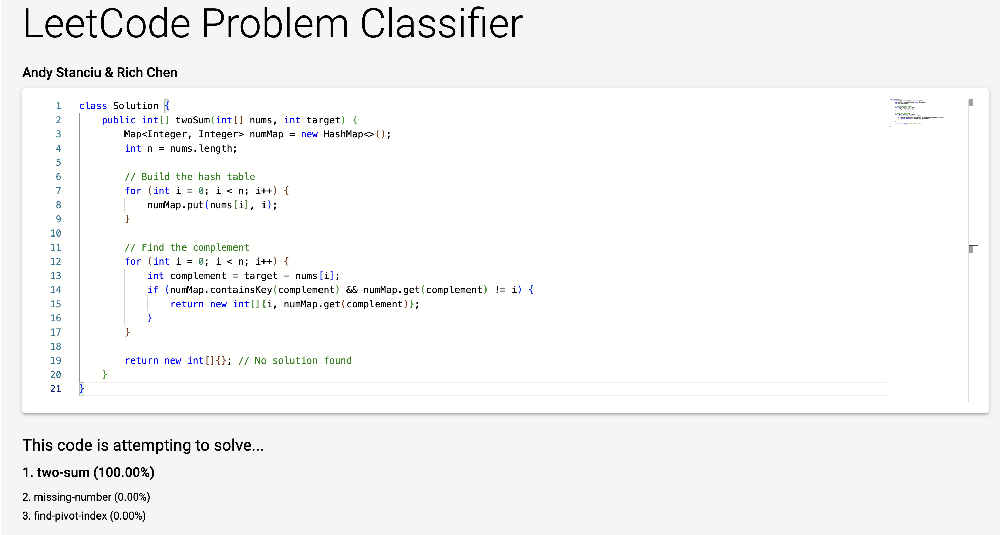

# Code Classifier
This is a UW CSE493G1 deep learning project by students Andy Stanciu & Rich Chen. The goal: given a Leetcode solution, identify the problem it is trying to solve. Exploring various neural network code classification architectures including (but not limited to) AST-based GNNs, CNNs, LSTMs, and potentially transformers.

## Contents
- `docs/` - Background documentation and project report.
- `src/model` - Various models we trained on our solution corpus. Includes Python utility classes for data vectorization, normalization, visualization, and interpretation.
- `src/old-model` - Deprecated models that we decided not to pursue.
- `src/frontend` - React app demoing our best model, pre trained and classifying user input in real-time.
- `src/backend` - Express.js node backend containing the `classify` API we call from our frontend in the demo.
- `src/scraper` - GraphQL based web scraper implemented in Python. Used to retrieve raw, unprocessed community solutions for various Leetcode solutions written in Java.
- `src/parser` - Java parser used to optionally preprocess solution data prior to feeding it into our models. The parser currently has the following capabilities, all of which are optional:
  1. Redacting "sensitive identifiers" from the source code, i.e. if any permutation of the problem title appears within an identifier in the solution, it is replaced with a generic "method1" or "var1" identifier.
  2. Stripping comments from the source code.
  3. Standardizing the formatting and whitespace of the source code.
- `src/preprocessing` - Various Python utilities for further data preprocessing.
- `solutions/` - Raw, redacted, and redacted/stripped Leetcode solutions.
- `data/` - Intermediate representations - edge lists and vectorized AST node embeddings - of the Leetcode solutions.

## How to run
1. In a terminal instance, start the backend. By default, it will be hosted on port `20501`.
   ```
   cd src/backend
   node index.js
   ```
2. In another terminal instance, start the frontend.
   ```
   cd src/frontend
   npm start
   ```
3. Install any missing node, python, or Java dependencies.
4. You should have spun up a functional web app hosted on `http://localhost:3000`! Start typing Java code in the code editor, and watch as the model predicts the top 3 most likely LeetCode problems you're trying to solve in real-time.





## How to train
1. Scrape Leetcode problem solutions. Example:
   ```
   python3 src/scraper/scraper.py --problems two-sum --count 100 
   ```
   If successful, scraped solutions can be found in `solutions/raw/two-sum`.
2. (Optional) Preprocess Leetcode solutions by standardizing their formatting, redacting sensitive identifiers, and/or stripping comments. 
   1. Execute `src/parser/src/main/me/andystanciu/parser/preprocessing/ParseSolutions.java`.
   2. If successful, for each (compiling) solution `foo` for LeetCode problem `Foo` in `solutions/raw/Foo/foo.txt`, an equivalent redacted and stripped + redacted version can be found in `solutions/redacted/Foo/foo.txt` and `solutions/redacted-stripped/Foo/foo.txt`, respectively.
3. Configure `MAX_SOLUTION_COUNT` in `src/preprocessing/preprocessing_constants.py`, and run `prune_solutions.py` to prune any extraneous solutions:
   ```
   python3 src/preprocessing/prune_solutions.py
   ```
4. Convert raw Leetcode problem solutions to our intermediate representation.
   1. Execute `src/parser/src/main/me/andystanciu/parser/converter/ConvertSolutions.java`.
   2. Each compiling solution will be outputted to an equivalent "edge list" representation. For example, solution `foo` for LeetCode problem `Foo` will be exported to `data/raw/Foo/foo.edges`, `data/redacted/Foo/foo.edges`, and `data/redacted-stripped/Foo/foo.edges`.
   3. Additionally, a cooccurrence matrix is computed for each corpus of data. These can be retrieved at `data/raw.cooccurrences`, `data/redacted.cooccurrences`, and `data/redacted-stripped.cooccurrences`.
5. Load the intermediate representation ASTs & occurrence encodings into our dataset, create a model, and train!
   1. Refer to Python notebook `src/model/Model 1 GCN.ipynb` for an end-to-end example of how we accomplished this.
